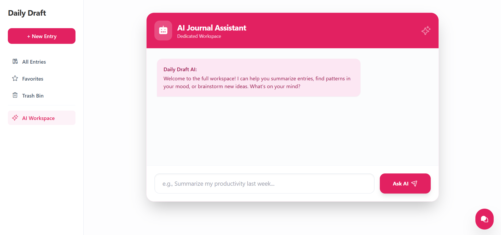

# CMSC129-Lab3-MagadanJ_MelchorEJ

# Daily Draft - AI Journal Assistant

Daily Draft is a Laravel MVC personal journal application enhanced for CMSC 129 Laboratory Assignment 3. Users can create, read, update, delete, restore, search, filter, and categorize journal entries. The Lab 3 version adds an on-page AI chatbot and an action-capable AI assistant for natural-language journal inquiries and CRUD operations.

## Lab 3 AI Features

- Floating chatbot widget embedded on the main journal pages, so users can ask questions while viewing entries.
- Dedicated AI workspace at `/chat` for larger conversations.
- Backend-only Gemini integration through Laravel HTTP requests.
- Session conversation history using the last 10 messages for follow-up questions and pronoun references.
- Saved chat history in the `ai_chat_messages` table, restored after page refresh for the same browser session.
- Journal-aware prompt context built from recent entries, categories, moods, locations, favorites, and summary facts.
- Natural-language CRUD assistant:
  - Create entries by chat command.
  - Read/query entries through the inquiry chatbot.
  - Update entries by ID, title, or recent reference.
  - Delete entries by moving them to the trash.
- Confirmation flow before destructive operations such as update and delete.
- UI loading states, error messages, confirmation buttons, and page refresh after successful AI CRUD actions.

## AI Service Used

- Provider: Google Gemini API
- Default model: `gemini-2.5-flash`
- Backend files:
  - `app/Services/AIService.php`
  - `app/Services/PromptService.php`
  - `app/Services/FunctionCallService.php`
  - `app/Http/Controllers/ChatBotController.php`
  - `app/Http/Controllers/AIAssistantController.php`

## Security Notes

- API keys are stored only in `.env`.
- `.env` is ignored by Git.
- Frontend JavaScript only calls Laravel routes.
- The browser never calls Gemini directly.
- The AI service uses backend tools to read or modify journal data; the external model never receives database credentials.

## Core Journal Features

- Complete CRUD operations for journal entries.
- Soft deletion with Trash Bin restore and permanent-delete routes.
- Categories with visual themes.
- Mood, category, favorite, and text search filters.
- Optional image upload per entry.
- Form validation and session success messages.

## Requirements

- PHP 8.4 or compatible dependency set
- Composer
- Node.js 16+
- PostgreSQL
- Google Gemini API key

Note: The current lock file includes Symfony 8 packages that require PHP 8.4+. If your local PHP is lower, reinstall dependencies for your PHP version or upgrade PHP before running Artisan commands.

## Setup

1. Clone the repository.

```bash
git clone [your-repository-url]
cd CMSC129-Lab3-MagadanJ_MelchorEJ
```

2. Install dependencies.

```bash
composer install
npm install
```

3. Create `.env`.

```bash
cp .env.example .env
```

4. Configure database and Gemini values in `.env`.

```env
DB_CONNECTION=pgsql
DB_HOST=127.0.0.1
DB_PORT=5432
DB_DATABASE=your_database_name
DB_USERNAME=your_database_user
DB_PASSWORD=your_database_password

GEMINI_API_KEY=your_real_gemini_api_key
GEMINI_MODEL=gemini-2.5-flash
```

5. Generate app key, migrate, seed, and link storage.

```bash
php artisan key:generate
php artisan migrate:fresh --seed
php artisan storage:link
```

6. Build assets and run the app.

```bash
npm run build
php artisan serve
```

Open `http://localhost:8000/entries`.

## Dummy Data

The seeder creates 5 categories and 15 realistic journal entries covering School, Work, Personal, Health, and Ideas. The entries include varied moods such as Happy, Focused, Stressed, Calm, Tired, Excited, and Grateful.

Run:

```bash
php artisan migrate:fresh --seed
```

## Example Inquiry Questions

- "How many journal entries do I have?"
- "Summarize my school entries."
- "Which entries are marked as favorites?"
- "What moods appear most often?"
- "Show me recent ideas."
- "What was my latest entry?"
- "Which entries mention deadlines?"

## Example CRUD Commands

Create:

```text
Create a new entry titled "Defense Prep" content "Reviewed the AI chatbot requirements" mood Focused category School location "Library"
```

Update:

```text
Update entry #3 mood to Happy
```

```text
Rename "Weekend Vibes" title to "Weekend Reset"
```

Delete:

```text
Delete entry #4
```

After an update or delete request, the assistant asks for confirmation. Reply `yes` or click Confirm to proceed. Reply `cancel` or click Cancel to stop.

## Conversation Context Tests

Try this sequence:

```text
What was my latest entry?
Update it mood to Happy
yes
```

Try this inquiry sequence:

```text
Show my school entries.
Which ones mention deadlines?
What about the favorite ones?
```

## Routes

- `GET /entries` - main journal dashboard with embedded chatbot widget
- `POST /chat-send` - web chatbot and assistant endpoint
- `GET /chat-history` - saved browser-session chat history endpoint
- `GET /chat` - dedicated AI workspace
- `POST /api/chat` - API chatbot endpoint
- `POST /api/ai-assistant` - API assistant endpoint

## Project Structure

```text
app/
  Http/Controllers/
    EntryController.php
    ChatBotController.php
    AIAssistantController.php
  Models/
    Entry.php
    Category.php
    AIChatMessage.php
  Services/
    AIService.php
    PromptService.php
    FunctionCallService.php
database/
  migrations/
  seeders/DatabaseSeeder.php
resources/
  js/chatbot.js
  views/chat/
  views/entries/
  views/layouts/app.blade.php
routes/
  web.php
  api.php
```
## App Screenshots


## Members

- Jasmine Magadan
- Eleah Joy Melchor
